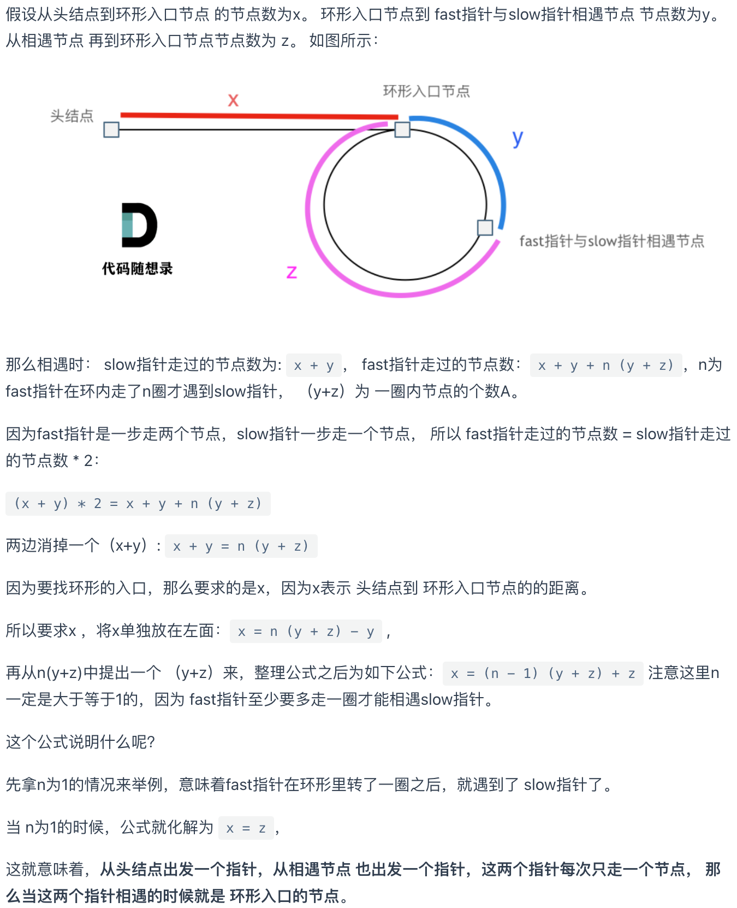

# Day04｜链表Linked List
## 总结

### LC24.两两交换链表中的节点
- 递归法，运用跟Day03反转链表相似的方法
```python
class Solution(object):
    def swapPairs(self, head):
        """
        :type head: ListNode
        :rtype: ListNode
        """
        if head is None or head.next is None:
            return head
        temp = self.swapPairs(head.next.next)
        res = head.next
        res.next = head
        head.next = temp
        return res
```
### LC19.删除链表的倒数第N个节点
- 快慢指针先找到倒数第N个节点
- 另存一下目标节点的上一个节点，然后直接删除当前节点
- 注意使用虚拟头节点避免出现删除第一个节点或者空链表是报错
```python
class Solution(object):
    def removeNthFromEnd(self, head, n):
        """
        :type head: ListNode
        :type n: int
        :rtype: ListNode
        """
        node_f, node_s = head, head
        dummyNode = ListNode(next = head)
        prev = dummyNode
        while n > 0:
            node_f = node_f.next
            n -= 1
        while node_f is not None:
            prev = node_s
            node_f, node_s = node_f.next, node_s.next
        prev.next = node_s.next
        return dummyNode.next
```
### LC160.相交链表
- 如果存在链表相交，相交点所在位置之后的链表完全相同，可以直接比较Node而不是节点值！！
- 链表长度不同，但相交点之后完全相同，因此只需要比较较短长度链表开始处的情况，较长链表前面多出来的部分没有影响
- 两个指针初始化在同一个长度的位置，同步向后移动，不断比较Node直到找到相同的节点
```python
class Solution(object):
    def getIntersectionNode(self, headA, headB):
        """
        :type head1, head1: ListNode
        :rtype: ListNode
        """
        # length of headA and headB
        lengthA, lengthB = 0, 0
        cur = headA
        while cur is not None:
            lengthA += 1
            cur = cur.next
        cur = headB
        while cur is not None:
            lengthB += 1
            cur = cur.next
        # 将两个指针移动到两个链表的相同位置，保证后续剩下的节点数量相同
        nodeA, nodeB = headA, headB
        if lengthA > lengthB:
            while lengthA > lengthB:
                nodeA = nodeA.next
                lengthA -= 1
        else:
            while lengthB > lengthA:
                nodeB = nodeB.next
                lengthB -= 1
        # 比较两个指针对应节点是否相等
        while nodeA is not None and nodeB is not None:
            if nodeA == nodeB:
                return nodeA
            else:
                nodeA = nodeA.next
                nodeB = nodeB.next
        return None
```
### LC142.环形链表II
- 分别考察判断是否存在环和**找出环的开始点**
- 判断是否存在环：快慢指针直到相遇，证明存在环
- **找出环的开始点：**
    - 使用数学推导，证明在快慢指针相遇的节点和头节点同时出发指针，每次移动一步，最终会在环的开始点相遇
    - 推导过程：
    - 动图:
```python
class Solution(object):
    def detectCycle(self, head):
        """
        :type head: ListNode
        :rtype: ListNode
        """
        # 先判断是否存在环：快慢指针
        fast, slow = head, head
        while fast is not None and fast.next is not None:
            fast = fast.next.next
            slow = slow.next
            if fast == slow: # 证明存在环
                # 根据数学推导，在head和相遇点分别放置两个指针并同时移动，相遇点为环开始节点
                idx1,idx2 = head,slow
                while idx1 != idx2:
                    idx1 = idx1.next
                    idx2 = idx2.next
                return idx1
        return None
```